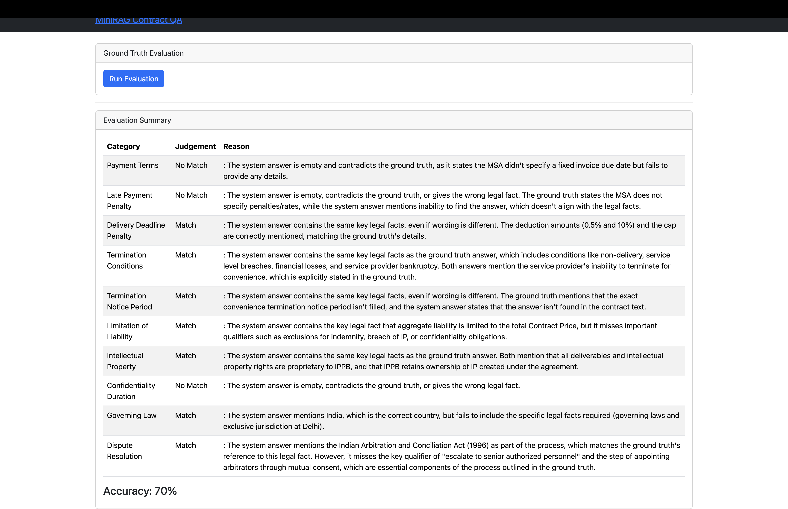
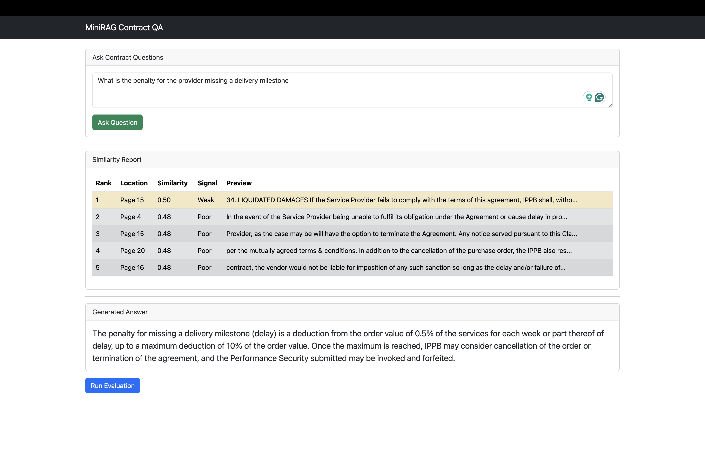

# MiniRAG MSA Contract Q&A System

This project is a working Retrieval-Augmented Generation (RAG) web application for asking questions over a Master Service Agreement (MSA). It was built for the KPi-Tech AI Interop Engineer assignment, whose main requirement is to upload an MSA, retrieve relevant contract evidence, display a scored similarity report, generate grounded answers, and evaluate the system against 10 prepared ground-truth questions.

The application uses Django for the UI, FAISS for vector search, SentenceTransformers for embeddings, and Ollama/Qwen for local LLM calls.

## Assignment Mapping

The project brief asks for five core components:

1. Document ingestion and chunking
2. Query embedding, retrieval, and similarity reporting
3. Answer generation using only retrieved context
4. Evaluation against 10 ground-truth questions using an LLM judge
5. A proper web interface

This repository implements those pieces through the Django app in `myproject/main_website`.

## MSA Used

The MSA used for development and evaluation is an India Post Payments Bank Limited Master Service Agreement template.

- Local file: `msa.pdf`
- Length: 24 pages
- Format: PDF
- Why this document was chosen: the assignment requires a publicly available MSA of at least 8-10 pages. This MSA is long enough, clause-heavy, and contains realistic contract sections such as payment terms, termination, liquidated damages, confidentiality, intellectual property, limitation of liability, governing law, and dispute resolution.

One important detail: this MSA is a template, so some fields are intentionally blank or refer to schedules such as `Schedule-B`. That makes the task more realistic because the system must avoid inventing values when the contract does not specify them.

## Tech Stack

- Backend/UI: Django
- PDF extraction: `pypdf`
- Chunking: `RecursiveCharacterTextSplitter`
- Embeddings: `sentence-transformers/all-mpnet-base-v2`
- Vector database: FAISS
- LLM runtime: Ollama
- Default answer model: `qwen3:0.6b`
- Evaluation file: `questions.json`

## How The Pipeline Works

### 1. Upload And Indexing

The upload page accepts a PDF or plain text contract. Earlier, the upload flow only marked the session as loaded and redirected to the query page. It did not actually extract, chunk, embed, or index the uploaded document.

This was corrected in `views.py`:

- `extract_uploaded_document()` extracts page-wise text from PDF files.
- `index_uploaded_document()` splits the extracted text into chunks.
- The chunks are embedded using SentenceTransformers.
- A new FAISS index is saved to `faiss_index`.
- The uploaded source file is stored in `uploaded_documents`.
- The in-memory vector store is refreshed so queries use the newly uploaded document.

### 2. Chunking Strategy

Current chunking configuration:

```python
chunk_size = 1200
chunk_overlap = 200
```

Justification:

- Legal clauses are often long and include exceptions, caps, notice periods, and survival language.
- A 1200-character chunk is large enough to preserve most clause context.
- A 200-character overlap reduces the chance that a heading appears in one chunk while the key legal obligation appears in the next.
- This is stronger than the earlier notebook setup, which used `chunk_size=1000` and only `chunk_overlap=30`. That small overlap made clause boundaries fragile.

### 3. Retrieval

For each user question:

1. The question is embedded using the same embedding model used for document chunks.
2. FAISS retrieves the most relevant chunks.
3. The app displays the top 5 chunks in the Similarity Report.

The Similarity Report includes:

- Rank
- Location
- Similarity score
- Score signal
- Chunk preview

Score signal logic:

- `0.85+` = Strong
- `0.70-0.84` = Good
- `0.50-0.69` = Weak
- Below `0.50` = Poor

### 4. Query Expansion And Reranking

A major weakness discovered during testing was that the user question wording did not always match the contract wording.

Examples:

- User asks: "Which state or jurisdiction governs this agreement?"
- Contract heading: "Applicable law and jurisdiction of court"

- User asks: "Who owns IP?"
- Contract heading: "Proprietary Rights"

- User asks: "Late payment penalty"
- Contract says: "Penalties shall be as per Schedule-B"

To improve retrieval accuracy, a lightweight query expansion layer was added. It maps common question terms to likely contract terms. For example:

- `governing` expands to `applicable law`, `jurisdiction of court`, `laws of India`, `courts at Delhi`
- `ip` expands to `proprietary rights`, `intellectual property rights`, `deliverables`
- `termination` expands to `termination of contract`, `material breach`, `bankruptcy`, `force majeure`, `convenience`

The retriever fetches more than 5 candidates, then reranks them using a small keyword bonus before displaying the final top 5.

This improves the chance that the LLM receives the right clause even when the user uses plain English instead of the contract's exact heading.

### 5. Answer Generation

The answer prompt instructs the model to:

- Answer only from retrieved context
- Avoid hallucinating dates, rates, notice periods, or clauses
- Explicitly say when a value is blank, unspecified, or governed by a schedule
- Use "I could not find the answer..." only when the retrieved chunks do not address the topic

This prompt change was important because the MSA template contains blanks and Schedule-B references. A weak prompt caused the model to say "not found" even when the correct answer was "the agreement says this is governed by Schedule-B."

## Evaluation Layer

The ground-truth file is `questions.json`. It contains the 10 required assignment categories:

1. Payment Terms
2. Late Payment Penalty
3. Delivery Deadline Penalty
4. Termination Conditions
5. Termination Notice Period
6. Limitation of Liability
7. Intellectual Property
8. Confidentiality Duration
9. Governing Law
10. Dispute Resolution

Each item includes:

- Category
- Example question
- Expected answer extracted from the MSA

During local testing, the file may also include cached `answer` fields. This is useful when running a small local model or avoiding repeated LLM calls during demo preparation. For a strict end-to-end evaluation run, the system answer should be generated fresh from retrieval, then judged against `expected_answer`.

The evaluation page runs the answers through a judge prompt and classifies each result as:

- Match
- Partial Match
- No Match

## Accuracy Issues Found During Testing

The low evaluation score was not only caused by the small local model. Several system-level issues were found.

### 1. Upload Did Not Build The Vector Index

The upload page originally accepted a file but did not process it into FAISS. This meant the app could continue querying an old index even after a user uploaded a new MSA.

Fix:

- Added PDF/text extraction
- Added recursive chunking
- Added embedding and FAISS save
- Refreshed the global vector store after upload

### 2. Chunk Overlap Was Too Small

The original notebook chunking used a very small overlap. Legal contracts often place a heading, condition, exception, and remedy across nearby text. If the overlap is too small, retrieval may return partial clauses.

Fix:

- Increased overlap to 200 characters
- Used recursive separators to keep paragraphs and sentences together where possible

### 3. Contract Terminology Did Not Match User Terminology

Vector search can miss clauses when the document uses legal headings and the question uses conversational wording.

Fix:

- Added query expansion for contract-specific synonyms
- Added lightweight keyword reranking

### 4. The Model Confused "Not Found" With "Not Specified"

For template fields, the correct answer is sometimes not a concrete value. For example, payment timing is not a fixed number of days in the main agreement; the agreement says payment terms are as per Schedule-B.

Fix:

- Prompt now tells the model to report blanks, unspecified fields, and schedule references explicitly.

### 5. The Judge Can Be Inconsistent

A small local model can judge semantically equivalent answers too harshly. For example, it may mark "IPPB owns the IP" as weaker than "deliverables and IP rights are proprietary to IPPB."

Fix:

- Judge prompt was tightened to focus on key legal facts, not exact wording.
- Parsing was adjusted to handle `Match`, `Partial Match`, and `No Match` consistently.

## Known Limitations

- `qwen3:0.6b` is very small for legal reasoning. It can miss qualifiers or overuse "not found."
- FAISS similarity search is semantic but not clause-aware. It does not understand contract structure by itself.
- Some expected answers require combining multiple clauses, such as termination conditions.
- Some MSA fields are blank because the document is a template.
- The evaluation judge is also model-based, so its score can vary between runs.

## How Results Could Be Improved Further

1. Use a stronger answer model  
   A larger local model or a stronger hosted model would improve clause understanding and reduce missed qualifiers.

2. Use a stronger judge model  
   The judge should ideally be stronger than the answer model. A weak judge may incorrectly mark correct answers as partial or no match.

3. Add hybrid retrieval  
   Combine FAISS semantic retrieval with BM25 keyword search. This would help exact legal terms like `Schedule-B`, `total Contract Price`, `Applicable law`, and `Liquidated Damages`.

4. Add clause-aware chunking  
   Instead of chunking by character count only, split around numbered headings such as `29. Termination of Contract`, `42. Limitation of Liability`, and `56. Resolution of disputes and arbitration`.

5. Add cross-encoder reranking  
   Retrieve 20 chunks with FAISS, then rerank them with a cross-encoder relevance model before sending top chunks to the LLM.

6. Return citations in final answers  
   The current UI shows evidence separately in the Similarity Report. A future version could include page references inside the generated answer.

7. Cache evaluation outputs  
   Running evaluation uses multiple LLM calls. Caching would make the demo more stable and avoid exhausting model/API quota.

8. Improve ground-truth strictness  
   For template clauses, expected answers should clearly distinguish between "not present anywhere" and "present but value is blank / points to Schedule-B."

## Running The Project

From the project root:

```bash
cd myproject
python3 manage.py runserver
```

Then open:

```text
http://127.0.0.1:8000/
```

Typical demo flow:

1. Open the home page.
2. Upload the MSA PDF.
3. Ask one or two live questions.
4. Show the Similarity Report for each query.
5. Open the evaluation page.
6. Run the 10-question evaluation and explain any failures.

## Demo Talking Points

During the demo, the most important engineering decisions to explain are:

- Why RAG is needed: the answer must be grounded in contract text, not model memory.
- Why chunking matters: poor chunking loses legal context.
- Why the Similarity Report matters: it makes retrieval transparent and debuggable.
- Why Schedule-B/template blanks matter: a good system should avoid inventing missing values.
- Why local Qwen results may be weaker: the model is small, but retrieval and prompt improvements still improve reliability.
- What would improve production quality: hybrid retrieval, clause-aware chunking, reranking, stronger LLM, stronger judge, and caching.





